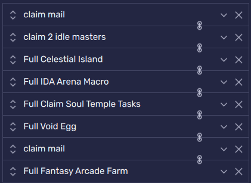
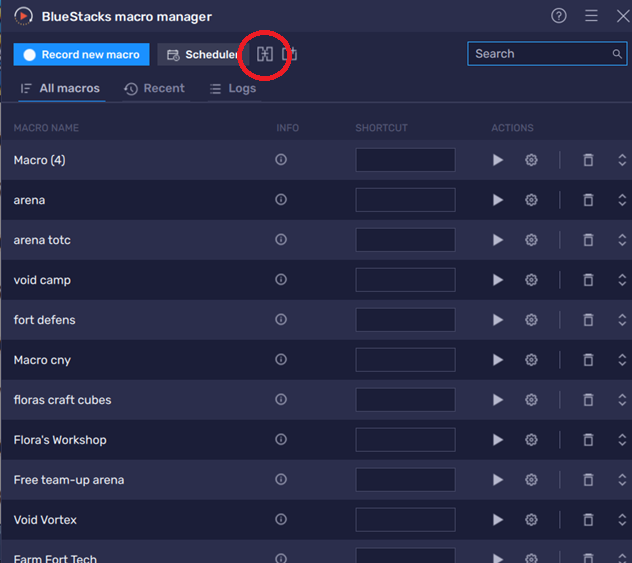
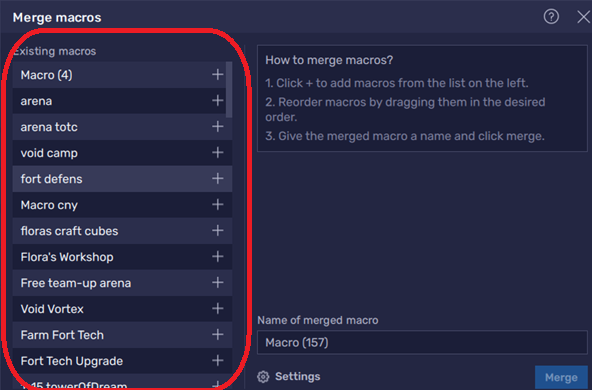
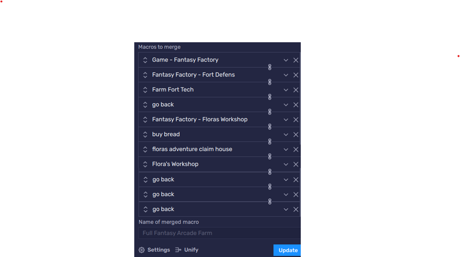

# 📅 Daily Chores — One-Tap Morning Routine

Tired of tapping through mail, Idle Master, Celestial Island, arenas, eggs, and Fantasy Factory every morning? This folder holds **ready-made daily macros** plus the **master merge** that chains them into a single **Full Simple Day** run.

> ⚠️ **Macros can sometimes fail.** UI pop-ups, lag, full bags, event screens, or a game patch can throw off fixed coordinates. Always **watch the first run** after an update, and keep the game on a **stable resolution** in BlueStacks.

---

## 🚀 Quick Start — Import the Full Day Macro

1. Import every macro JSON you plan to use (see subfolders below, or import the whole repo tree).
2. In BlueStacks **Macro Manager**, select **`Full Simple Day Macro.json`** and press **Play**.
3. Start from a **clean home screen** (no blocking pop-ups). **Skip Battle** and other mode-specific settings should already match each sub-macro’s README.

**File:** [`Full Simple Day Macro.json`](./Full%20Simple%20Day%20Macro.json)

This is a **pre-merged** daily chain. The sections below explain what each piece does and how to **build or customize** your own merge.

---

## 🧩 Daily Task Modules

Each task lives in its own folder with a focused macro and README:

| Folder | Macro | Role |
|--------|-------|------|
| [claim mail](./claim%20mail/) | `claim mail.json` | Opens mail and claims **all available** messages/rewards. |
| [claim 2 idle masters](./claim%202%20idle%20masters/) | `claim 2 idle masters.json` | Runs **Idle Master twice** to clear daily quest progress (tuned for **Perfect Smash** / Void Vortex pacing). |
| [Full Celestial Island](./Full%20Celestial%20Island/) | `Full Celestial Island .json` | Completes **Celestial Island** daily tasks (expeditions, Nest of Void, island clears). |
| [Full IDA Arena Macro](./Full%20IDA%20Arena%20Macro/) | `Full IDA Arena Macro.json` | **Inter-Dimensional Arena** — refreshes teams and claims **quest / milestone rewards**. |
| [Full Claim Soul Temple Tasks](./Full%20Claim%20Soul%20Temple%20Tasks/) | `Full Claim Soul Temple Tasks.json` | Navigates **Soul Temple** and claims **quest / awakening milestone** rewards. |
| [Full Void Egg](./Full%20Void%20Egg/) | `Full Void Egg.json` | Claims **Void Eggs** and runs **integration** for all available eggs. |
| [Full Fantasy Arcade Farm](./Full%20Fantasy%20Arcade%20Farm/) | `Full Fantasy Arcade Farm.json` | Farms **gold** and **hammers** via **Fort Defense** + **Flora’s Workshop** loops. |

**Optional composite:** [`Full Integration.json`](./Full%20Integration.json) — another merged workflow if you prefer that bundle over the simple day macro.

### Example merge order (matches community “Daily Chores” preset)

Typical stack:

1. `claim mail`
2. `claim 2 idle masters`
3. `Full Celestial Island`
4. `Full IDA Arena Macro`
5. `Full Claim Soul Temple Tasks`
6. `Full Void Egg`
7. `claim mail` *(second pass — catches mail that arrived mid-run)*
8. `Full Fantasy Arcade Farm`

Reorder to taste. Duplicate **claim mail** is intentional for late-arriving rewards.

---

## 🔗 How to Build a Macro from Other Macros (BlueStacks **Merge**)

BlueStacks lets you **chain** small macros into one long script—perfect for dailies. Think of it as LEGO:

- **Action macros** — do work *inside* a mode (claim mail, fight arena, farm fort).
- **Move-around macros** — navigate **from screen A → screen B**. In this repo, names with a **hyphen** usually mean routing, e.g. `Game - Fantasy Factory` (home → Fantasy Factory hub) or `Fantasy Factory - Fort Defens` (factory hub → Fort Defense).

You stitch **move-around** macros between **action** macros so each piece stays small and reusable.

### Step 1 — Open the Merge menu

In **Macro Manager**, click the **Merge** button (two linked squares) next to **Scheduler**:

### Step 2 — Add macros from the list

On the left, click **`+`** next to each macro you want in the chain:

### Step 3 — Order, name, and merge

1. **Drag** entries into execution order (move-arounds before/after actions as needed).
2. Name the merged macro (e.g. `My Daily Routine`).
3. Click **Merge** (or **Update** when editing an existing merge).

### Example — `Full Fantasy Arcade Farm` internals

This composite shows the **A → B → action → go back** pattern:

Rough flow:

1. `Game - Fantasy Factory` — enter Fantasy Factory from the main map.
2. `Fantasy Factory - Fort Defens` — open Fort Defense.
3. `Farm Fort Tech` — farm tech / resources.
4. `go back` — return one screen.
5. `Fantasy Factory - Floras Workshop` — open Flora’s Workshop.
6. `buy bread`, `floras adventure claim house`, `Flora's Workshop` — workshop actions.
7. `go back` × 3 — unwind to a neutral screen.

Browse the full list of **navigation** macros in **[Move From A → B](../MoveFromAToB/)** and **building blocks** in **[All Components](../AllComponents/)**.

---

## 📚 Related Docs

- [Import macros & controls (main README)](../README.md#how-to-import-macros--controls)
- [All Components catalog](../AllComponents/)
- [Flora’s Adventure strategy](../FantasyFactory/FantasyFactory_FlorasAdventure/) — board setup for workshop macros used inside Fantasy Arcade Farm

Happy unattended dailies — and remember to glance at the screen now and then. ☕
---

If these tools save you time and help you skip the grind, please consider **dropping a ⭐ Star on this repository** on GitHub—it helps others discover the project and keeps motivation high for everyone contributing!

