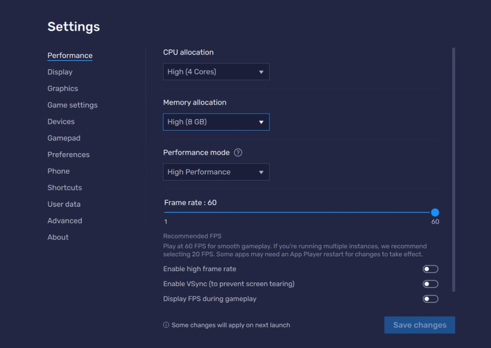

# 🏰 Fort Defense — macros & lag controls

Automated **normal-level clears** for Fantasy Factory Fort Defense. For **hammer / fort-tech farming**, see **[Fort Tech Farm](../FantasyFactory_FortTechFarm/README.md)**.

> ⚠️ Macros can sometimes fail — usually from a **game crash**, not the script itself. See [performance notes](#performance--game-crashes) below.

---

## 📁 What’s in this folder

| File | Type | Purpose |
|------|------|---------|
| `LowLagFortDefensControls.cfg` | Control | Lowest lag tolerance (fewest D-pad layers) |
| `MidLagFortDefensControls.cfg` | Control | **Recommended starting point** |
| `HighLagFortDefensControls.cfg` | Control | More D-pad layers — needs more CPU |
| `ExtremeLagFortDefensControls.cfg` | Control | Maximum lag compensation |
| `Phase1 Tower Defens LV1.json` | Macro | **Trial Mode Ch.1** — phase 1 (early waves, until ~wave 15) |
| `Phase 2 FortDefens lv1.json` | Macro | **Trial Mode Ch.1** — phase 2 (after prep; troops, abilities, Vesa farm) |
| `Full CH 1 and 2 Normal Levels.json` | Macro | Auto-clear **all normal levels** in chapters 1–2 |
| `Full CH 3 and 4  Normal Levels.json` | Macro | Auto-clear **all normal levels** in chapters 3–4 |

**Hammer / fort-tech farming** → [`FantasyFactory_FortTechFarm/`](../FantasyFactory_FortTechFarm/README.md)

---

## 📥 Step 1 — Import controls

Follow the **[import tutorial in the main README](../../README.md#-how-to-import-macros--controls)** (macros **and** controls sections).

Import **one** lag control scheme from this folder:

| Scheme | When to use |
|--------|-------------|
| `MidLagFortDefensControls.cfg` | **Try this first** — works for most PCs |
| `LowLagFortDefensControls.cfg` | Very fast / low-latency emulator |
| `HighLagFortDefensControls.cfg` | Still misplacing taps on Mid — needs **6 CPU cores** |
| `ExtremeLagFortDefensControls.cfg` | Last resort — needs serious hardware |

### How to know if controls are working

When abilities fire correctly, **purple snakes** should stack on the board like this:

**Too laggy?** If the D-pad **drags the screen down** and drops the ability in a **corner** instead of on the field, step **down** to a lower lag profile (e.g. Mid → Low).

---

## 📥 Step 2 — Import macros

Import these from this folder (same [import guide](../../README.md#-how-to-import-macros--controls)):

**Normal chapters**

1. **`Full CH 1 and 2 Normal Levels.json`**
2. **`Full CH 3 and 4  Normal Levels.json`**

**Trial Mode Chapter 1** (see [guide](#-trial-mode--chapter-1-guide))

3. **`Phase1 Tower Defens LV1.json`**
4. **`Phase 2 FortDefens lv1.json`**

These clear **every normal level** in those chapters. Fort tech upgrades are **not required**, but upgraded tech makes runs faster and smoother.

You need to do the **first level manually** — you don't have access to abilities yet. From **level 2, chapter 1** onward you can use the macros and controls.

---

## 🎮 How to use — normal level farm

1. **Select** the lag control scheme you imported (`fortDefens_MidLag`, etc.) in BlueStacks **Controls editor**.
2. **Start** a normal level and pick **purple snakes** as your **first ability** (required every run).
3. **Run** `Full CH 1 and 2 Normal Levels` or `Full CH 3 and 4  Normal Levels`.
4. **Watch** — the macro handles placement and waves.

### Notes

- You need to do the **first level manually** — you don't have access to abilities yet. From **level 2, chapter 1** onward you can use the macros and controls.
- You must **select snake first** each run — the macro assumes snakes are ability slot 1.
- Crashes are rare but possible; see below.

---

## 🏆 Trial Mode — Chapter 1 guide

> **Scope:** This guide covers **Trial Mode Chapter 1 only**. Guides for chapters 2–5 will be added later.

Trial Mode Ch.1 is a **two-phase** run. Use **`Phase1 Tower Defens LV1`** first, then switch to **`Phase 2 FortDefens lv1`** after you prep.

### Phase 1 → Phase 2

1. **Start the run** and launch **`Phase1 Tower Defens LV1`**.
2. Let it run until it **fails** — usually around **wave 15**.
3. **Stop** and **prepare for phase 2** (see below).
4. Launch **`Phase 2 FortDefens lv1`** and let it finish the run.

### Before phase 2 — prep checklist

**Fort tech** — upgrade as far as you can. It is **recommended to clear all normal chapters first** ([`Full CH 1 and 2`](./Full%20CH%201%20and%202%20Normal%20Levels.json) · [`Full CH 3 and 4`](./Full%20CH%203%20and%204%20%20Normal%20Levels.json)) before pushing Trial Mode.

**Abilities** — when picking upgrades during the run:

| Slot | Pick |
|------|------|
| **Ability 1** | **Purple snakes** (required) |
| **Other abilities** | Spread across **all elements** where you can |

Element goals (first option is usually best in each group):

| Element | Options to aim for |
|---------|------------------|
| **Fire** | Mines or Bombs |
| **Ice** | Tornado, Ice Spikes |
| **Electricity** | Totems, Lightning |

**Heroes** — save **20 unit upgrade points** so you can unlock **Vesa** and **Aspen** before phase 2.

### Phase 2 — step by step

1. **Start** the Trial Mode Ch.1 run.
2. **Unlock Vesa and Aspen** by spending unit upgrade points on their towers.
3. **Start** the **`Phase 2 FortDefens lv1`** macro.
4. **Let it run** — do not interrupt unless something breaks.

### What the phase 2 macro does (Trial Mode lv1)

- **Supplies all troops** at all times
- **Casts all abilities** multiple times per wave
- **Farms Vesa heroes** on **path 2**

### What can go wrong

- **Boss Dominator waves** — common failure point for the macro
- **Game crashes** — see [performance notes](#performance--game-crashes); bump BlueStacks cores while farming

### Expectations

Trial Mode gets **very hard** quickly. A macro is **not as good as a human** — try the mode yourself to learn the pacing.

**No guarantee** the macro reaches **wave 100**. Use it to grind hammers and progress, not as a perfect autopilot.

For hammer-only farming after Ch.1 is set up, see **[Fort Tech Farm](../FantasyFactory_FortTechFarm/README.md)**.

---

## ⚙️ Performance & game crashes

If the game **crashes** during long runs, raise BlueStacks **CPU allocation** in **Settings → Performance**:

| Lag profile | Suggested CPU cores |
|-------------|---------------------|
| **Mid Lag** | **4 cores** (decent default) |
| **High Lag** | **6 cores** |
| **Extreme Lag** | Top-tier hardware — “NASA-grade server” territory |

**Note:** Assigning **6 cores** only works if your CPU has **6 or more physical/logical cores**. More cores for BlueStacks means **less CPU left for the rest of your PC** — you’re shifting performance from Windows into the emulator.

**Tip:** If you’re running macros, it’s recommended to **bump cores up while the macro runs**, then **switch back to your usual performance settings** when you’re done.

Some settings apply on the **next BlueStacks launch** — save and restart if needed.

---

## 🔗 Related

- [Fort Tech & hammer farming](../FantasyFactory_FortTechFarm/README.md)
- [Import macros & controls](../../README.md#-how-to-import-macros--controls)
- [Move From A → B — `Fantasy Factory - Fort Defens`](../../MoveFromAToB/Fantasy%20Factory%20-%20Fort%20Defens.json)
- [All Components catalog](../../AllComponents/README.md)

---

If these tools save you time and help you skip the grind, please consider **dropping a ⭐ Star on this repository** on GitHub—it helps others discover the project and keeps motivation high for everyone contributing!

