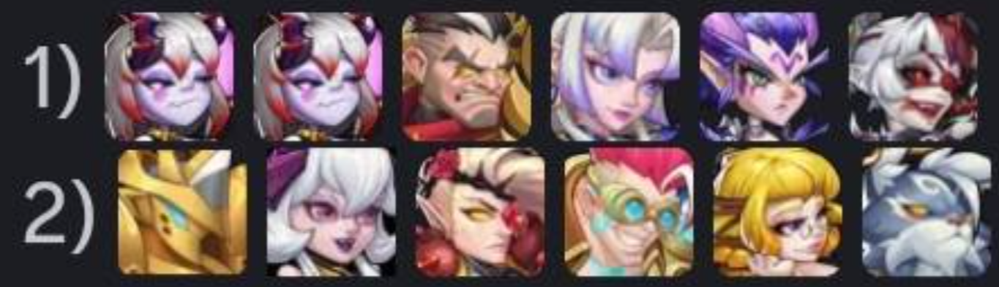
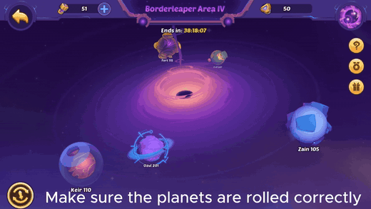

# 🌌 Void Vortex Macro & Controls

Welcome to the **Void Vortex** toolkit for Idle Heroes on BlueStacks! This macro automates the repetitive grind of **smashing planets** in the Void Vortex. Together with a **custom control scheme**, it helps you **select planets cleanly** no matter where they sit on their orbit and **kick off battles** with confidence—so you spend less time babysitting taps and more time enjoying the rewards.

---

## 📦 Files Included

This folder ships **two companion files**—use **both** for the intended experience:

- **`Void Vortex.json` (the macro)** — Automates the tap flow for **planet selection** and **starting battles**, so the loop runs smoothly from planet to planet.
- **`voidVortex.cfg` (custom controls)** — A BlueStacks **keymapping** profile the macro is designed around. It maps gameplay actions so pressing **`1`** can **target planets dynamically**, avoiding brittle **fixed-coordinate taps** on **moving orbital paths**.

---

## ⚠️ Prerequisites & Disclaimer *(CRITICAL)*

Please read this block **before** you hit **Play** on the macro:

- **Skip Battle must be ON** — You **MUST** enable the in-game **Skip Battle** option. The macro assumes fights **resolve instantly**; if the game sits through combat animations, the flow can **stall or desync**.
- **Macro ≠ auto-win** — The macro only performs the **click sequence**. Your roster still needs to be **strong enough** to clear the planets you are targeting.
- **Reroll enemies first (manual step)** — You **MUST** manually reroll enemies on the planets **before** starting the macro. Aim to match the optimal enemy team layouts shown in the reference below for the smoothest clears.
- **Transcendent Protection on the last stages** — **Levels 1 and 2 are the last stages** of the Void Vortex board. You **MUST** manually confirm **Transcendent Protection** is active for **every fight** on those planets before you let the macro run unattended.

---

## 🧭 Step-by-Step Usage Guide

1. **Import both assets into BlueStacks** — Bring in **`Void Vortex.json`** (macro) and **`voidVortex.cfg`** (controls). For the full walkthrough, see **[Import tutorial in the main README](../../README.md#how-to-import-macros--controls)**.
2. **Select the custom scheme** — In BlueStacks, choose the imported **`voidVortex.cfg`** control profile so the **`1`**-key behavior matches what the macro expects.
3. **Prep your Vortex board (manual)** — Reroll enemies to match the reference image, double-check **Skip Battle**, and apply **Transcendent Protection** on **Levels 1 & 2** (the **last** stages).
4. **Run the macro** — Start **`Void Vortex.json`** from the Macro Manager and let it rip.

---

## 🔁 Loop Count & Void Vortex Tries

- By default, this macro is configured to loop through up to **100 Void Vortex Tries** (`LoopIterations` in the macro JSON).
- Want **fewer** battles? You have two easy options:
  1. **Spend cap via inventory** — Keep only the **exact number of Void Vortex Tries** you want to use in your bag before starting (so the game naturally stops you when you run out).
  2. **Lower the repeat count in BlueStacks** — Open the macro’s settings and reduce **Repeat execution** / loop count to match your desired number of battles.

---

## 🎬 Watch it in Action

Here’s **`Void Vortex.json`** with **`voidVortex.cfg`** active—**planet selection**, **`1`**-key targeting, and **battle starts** so you can see how the loop behaves end to end.

### Inline playback (shows directly in README)

GitHub’s README viewer does **not** reliably render `<video>` tags, and **MP4s usually will not autoplay inline** the way a GIF does.

This folder uses a **relative path** to the preview GIF so it loads in **Cursor / VS Code Markdown preview** and on **GitHub** from the same commit—no dependency on `raw.githubusercontent.com` (which breaks until you **push**, and can be blocked in some previews).

**Preview (GIF, loops):** click the image to open the full **MP4** in the browser.

**Full-quality MP4** (same file as the link target above): [open `VoidVortexMacroDemo.mp4`](../../docs/videos/VoidVortexMacroDemo.mp4)

If you are on **github.com** and your browser still will not play it inline, try this **raw** URL on its own line (GitHub sometimes turns it into a player):

https://github.com/Ramulica/Idle-Heroes-Community-Macros/raw/master/docs/videos/VoidVortexMacroDemo.mp4

**Troubleshooting a blank GIF:** confirm `docs/images/void-vortex/void_vortex_macro_demo_preview.gif` exists on disk, then **`git push`** so GitHub serves the same files you see locally.

### Smoother MP4 with native controls?

If the URL above only shows as a link, attach a trimmed copy via the README editor on **github.com** (GitHub uploads to `user-images.githubusercontent.com`), then paste that URL on its own line—same trick described in **[Flora’s Adventure README](../../FantasyFactory/FantasyFactory_FlorasAdventure/README.md#want-the-smoother-mp4-with-native-controls)**.
