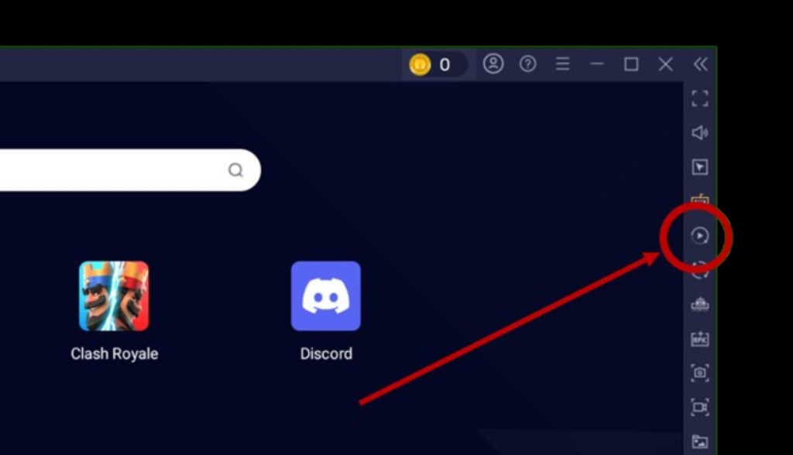
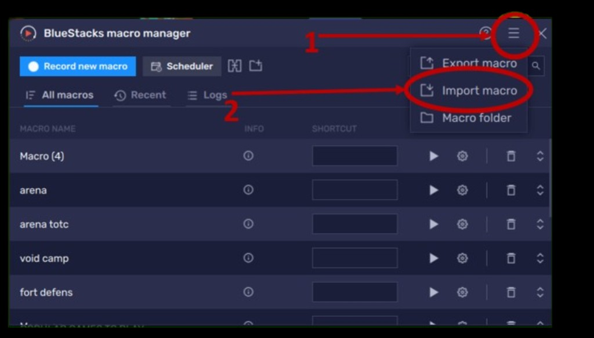
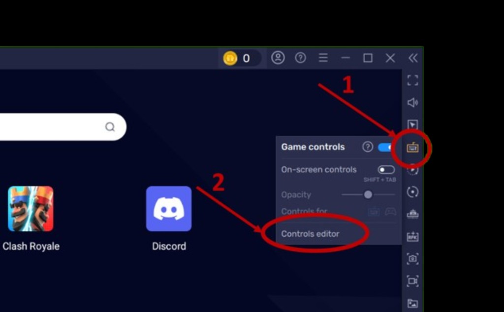
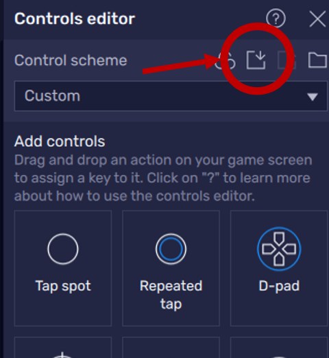

# ⚔️ Idle Heroes Ultimate Community Macros & Controls

Welcome! This repository is a **100% free**, **community-driven** project dedicated to Idle Heroes players who want dependable macros and custom key controls for every major game mode and daily task—built for BlueStacks and similar Android emulators.

If these tools save you time and help you skip the grind, please consider **dropping a ⭐ Star on this repository** on GitHub—it helps others discover the project and keeps motivation high for everyone contributing!

---

## 💡 The Core Philosophy — Why Use These Macros?

Idle Heroes asks for a lot of repetitive taps and routing between modes. These macros focus on three practical goals:

1. **Automate the repetitive stuff** — Daily and weekly loops run smoothly without babysitting every screen transition.
2. **Summon smarter** — Flows are tuned so micro-summons and related tasks stay safer on bag space (fewer “oops, inventory full” moments).
3. **Move faster inside your emulator** — Navigation is scripted so BlueStacks stays predictable: fewer missed taps, cleaner routing between **A → B**, arenas, factories, and battle hubs.

Everything here is meant to be shared, improved, and maintained together as the game evolves.

---

## 📂 Macro & Control Directories

Click any folder below to jump straight into the macros and configs for that part of the game.

### [Arena Battles](./ArenaBattles/)

PvP-style arenas and competitive ladders:

- [Free Team-Up Arena](./ArenaBattles/FreeTeamUpArena/)
- [Inter-Dimensional Arena](./ArenaBattles/InterDimensionalArena/)
- [Trial of the Champion](./ArenaBattles/TrialOfTheChampion/)

### [Fantasy Factory](./FantasyFactory/)

Crafting, fort scenarios, and factory-side content:

- [Flora's Adventure](./FantasyFactory/FantasyFactory_FlorasAdventure/)
- [Fort Defense](./FantasyFactory/FantasyFactory_FortDefense/)
- [Heroic Breakout](./FantasyFactory/FantasyFactory_HeroicBreakout/)
- Additional macros may also live at the [Fantasy Factory root](./FantasyFactory/) as shared `.json` / `.cfg` helpers—browse there if you don't see what you need in a subfolder yet.

### [Game Mode Battles](./GameModeBattles/)

Structured PvE/PvP-ish modes outside the core campaign loop:

- [Void Campaign](./GameModeBattles/VoidCampaign/)
- [Void Vortex](./GameModeBattles/VoidVortex/)

### [Move From A → B](./MoveFromAToB/)

Routing and navigation macros that stitch screens together *(folder scaffold — drop-in macros welcome!)*.

### [Summons](./Summons/)

Summon-focused flows with careful pacing for inventory sanity:

- [Cores of Origin](./Summons/CoresOfOrigin/)
- [Heroic Summons](./Summons/HeroicSummons/)
- [Prophet Orbs](./Summons/ProphetOrbs/)
- [Wishing Coins](./Summons/WishingCoins/)

---

## 🚀 How to Import Macros & Controls

Below are short visual guides—swap the image paths under `./docs/images/` whenever you finalize filenames.

### Macros — Recordings & scripted taps

**Step 1 — Open the Macro Manager**

Click the Macro recorder icon on the BlueStacks side toolbar.

**Step 2 — Import your macro file**

In the Macro Manager, open the menu (☰) and choose **Import macro**, then pick the `.json` you downloaded from this repo.

### Key controls — Keyboard & tap mapping

**Step 3 — Open Game controls**

Use the keyboard / game-controls icon on the side toolbar, then select **Controls editor** (via the Game controls panel).

**Step 4 — Import a custom control scheme**

In **Controls editor**, set **Control scheme** to **Custom** (if needed), then use the **Import** control-scheme button to load the matching `.cfg` from this repo.

> **Tip:** After importing, test in a safe screen (town / bag) before running long unattended sessions. Resolution, UI scale, and BlueStacks version can all affect alignment.

---

## 🤝 Footer & Community Contribution

We're glad you're here! If a macro breaks after a patch, you spot a safer summon pattern, or you want to document a new mode—**open an issue**, send a **pull request**, or start a discussion. Together we keep this toolkit accurate, friendly, and worthy of that ⭐ up top.

Happy grinding—but smarter.
