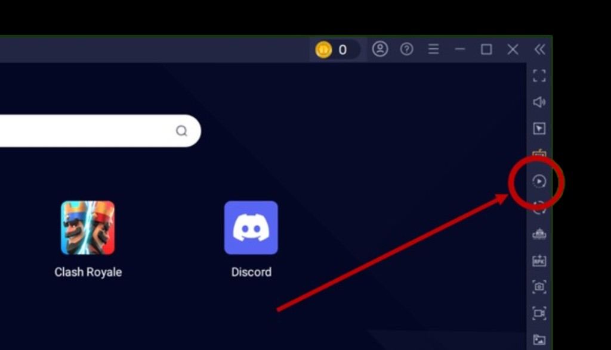
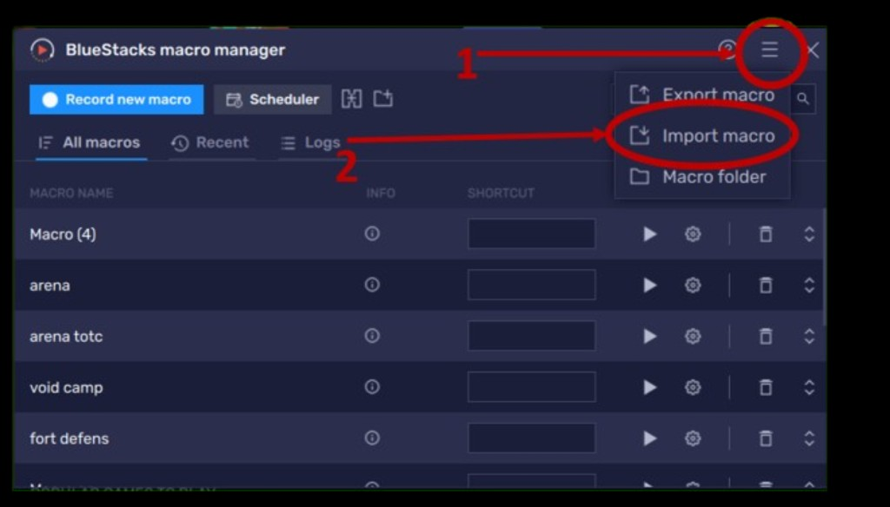
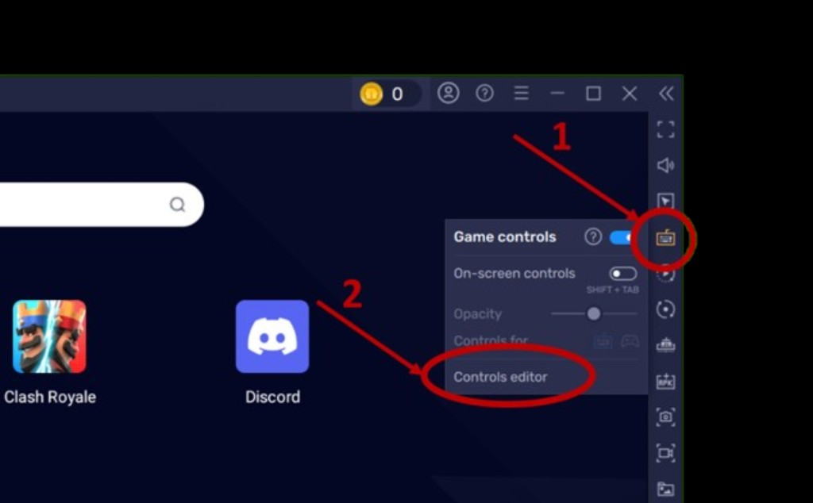
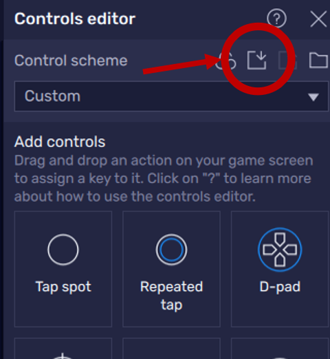

# ⚔️ Idle Heroes Ultimate Community Macros & Controls

Welcome! This repository is a **100% free**, **community-driven** project dedicated to Idle Heroes players who want dependable macros and custom key controls for every major game mode and daily task—built for BlueStacks and similar Android emulators.

If these tools save you time and help you skip the grind, please consider **dropping a ⭐ Star on this repository** on GitHub—it helps others discover the project and keeps motivation high for everyone contributing!

---

## 💡 The Core Philosophy — Why Use These Macros?

Idle Heroes asks for a lot of repetitive taps and routing between modes. These macros focus on three practical goals:

1. **Automate the repetitive stuff** — Daily and weekly loops run smoothly without babysitting every screen transition.
2. **Summon smarter** — Flows are tuned so micro-summons and related tasks stay safer on bag space (fewer “oops, inventory full” moments).
3. **Move faster inside your emulator** — Navigation is scripted so BlueStacks stays predictable: fewer missed taps, cleaner routing between **A → B**, arenas, factories, and battle hubs.

Everything here is meant to be shared, improved, and maintained together as the game evolves.

---

## 📂 Macro & Control Directories

Click any folder below to jump straight into the macros and configs for that part of the game.

### [Daily Chores](./DailyChores/README.md)

**One-tap morning routine** — pre-merged dailies plus a guide to building your own chains with BlueStacks **Macro Merge**:

- [Full Simple Day Macro](./DailyChores/Full%20Simple%20Day%20Macro.json) — master daily bundle
- [claim mail](./DailyChores/claim%20mail/README.md) · [claim 2 idle masters](./DailyChores/claim%202%20idle%20masters/README.md)
- [Full Celestial Island](./DailyChores/Full%20Celestial%20Island/README.md) · [Full IDA Arena Macro](./DailyChores/Full%20IDA%20Arena%20Macro/README.md)
- [Full Claim Soul Temple Tasks](./DailyChores/Full%20Claim%20Soul%20Temple%20Tasks/README.md) · [Full Void Egg](./DailyChores/Full%20Void%20Egg/README.md)
- [Full Fantasy Arcade Farm](./DailyChores/Full%20Fantasy%20Arcade%20Farm/README.md)

### [All Components](./AllComponents/README.md)

**Building-block catalog** — every action, navigation, and utility macro indexed by category (use with [Move From A → B](./MoveFromAToB/) for routing).

### [All Macros](./AllMacros/README.md)

**Flat folder** — all macro `.json` files in one place for quick import or download (mirrors the categorized folders above).

### [Arena Battles](./ArenaBattles/README.md)

PvP-style arenas and competitive ladders:

- [Free Team-Up Arena](./ArenaBattles/FreeTeamUpArena/README.md)
- [Inter-Dimensional Arena](./ArenaBattles/InterDimensionalArena/README.md)
- [Trial of the Champion](./ArenaBattles/TrialOfTheChampion/README.md)

### [Fantasy Factory](./FantasyFactory/README.md)

Crafting, fort scenarios, and factory-side content:

- [Fort Defense](./FantasyFactory/FantasyFactory_FortDefense/README.md) — lag controls & chapter level clears
- [Fort Tech Farm](./FantasyFactory/FantasyFactory_FortTechFarm/README.md) — hammer farming & fort-tech upgrades
- [Flora's Adventure](./FantasyFactory/FantasyFactory_FlorasAdventure/README.md)
- [Heroic Breakout](./FantasyFactory/FantasyFactory_HeroicBreakout/README.md)

### [Game Mode Battles](./GameModeBattles/README.md)

Structured PvE/PvP-ish modes outside the core campaign loop:

- [Void Campaign](./GameModeBattles/VoidCampaign/README.md)
- [Void Vortex](./GameModeBattles/VoidVortex/README.md)
- [Celestial Island](./GameModeBattles/CelestialIsland/README.md)
- [Soul Temple](./GameModeBattles/SoulTemple/README.md)
- [Void Egg](./GameModeBattles/VoidEgg/README.md)
- [Tower of Dream](./GameModeBattles/TowerOfDream/README.md)
- [Ethereal Realm](./GameModeBattles/EtherealRealm/README.md)

### [Move From A → B](./MoveFromAToB/README.md)

Routing and navigation macros that stitch screens together — names with a **hyphen** (`Game - Arena`, `Fantasy Factory - Fort Defens`) mean **go from A to B**. Pair with action macros via **[Macro Merge](./DailyChores/README.md#-how-to-build-a-macro-from-other-macros-bluestacks-merge)**.

### [Summons](./Summons/README.md)

Summon-focused flows with careful pacing for inventory sanity:

- [Cores of Origin](./Summons/CoresOfOrigin/README.md)
- [Heroic Summons](./Summons/HeroicSummons/README.md)
- [Prophet Orbs](./Summons/ProphetOrbs/README.md)
- [Wishing Coins](./Summons/WishingCoins/README.md)

---

## 🚀 How to Import Macros & Controls

Below are short visual guides (screenshots live in [`docs/images/`](./docs/images/)).

### Macros — Recordings & scripted taps

**Step 1 — Open the Macro Manager**

Click the Macro recorder icon on the BlueStacks side toolbar.

**Step 2 — Import your macro file**

In the Macro Manager, open the menu (☰) and choose **Import macro**, then pick the `.json` you downloaded from this repo.

### Key controls — Keyboard & tap mapping

**Step 3 — Open Game controls**

Use the keyboard / game-controls icon on the side toolbar, then select **Controls editor** (via the Game controls panel).

**Step 4 — Import a custom control scheme**

In **Controls editor**, set **Control scheme** to **Custom** (if needed), then use the **Import** control-scheme button to load the matching `.cfg` from this repo.

> **Tip:** After importing, test in a safe screen (town / bag) before running long unattended sessions. Resolution, UI scale, and BlueStacks version can all affect alignment.

---

## 🤝 Footer & Community Contribution

If these tools save you time and help you skip the grind, please consider **dropping a ⭐ Star on this repository** on GitHub—it helps others discover the project and keeps motivation high for everyone contributing!

We're glad you're here! If a macro breaks after a patch, you spot a safer summon pattern, or you want to document a new mode—**open an issue**, send a **pull request**, or start a discussion.

Happy grinding—but smarter.
